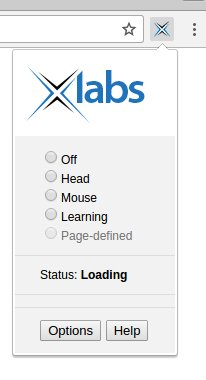
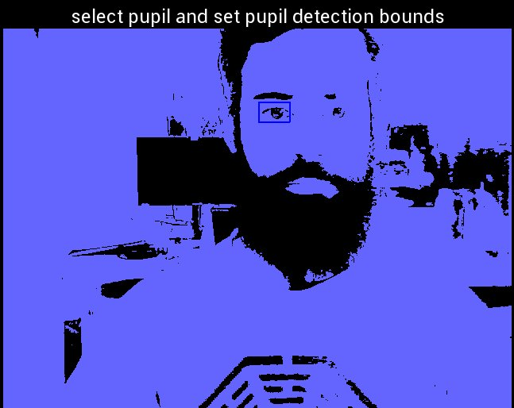
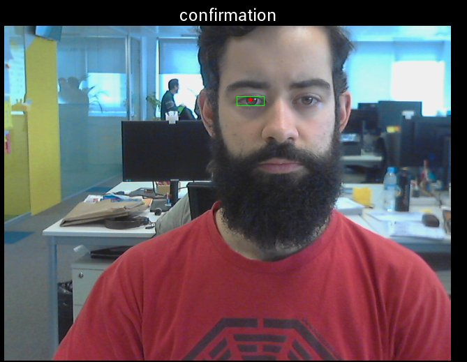

# EYE TRACKING (with a webcam)

## xLabs
* MAIN PAGE: https://xlabsgaze.com/
* TESTS:
	* Installed [chrome extension](https://chrome.google.com/webstore/detail/xlabs-headeyegaze-tracker/emeeadaoegehllidjmmokeaahobondco?hl=en-US).
* CONCLUSION:
  * Looks promising. There are examples, videos, documentation.
	* Last new is from March 10, 2015. Abandoned project?
  * Proprietary software.
  * Never worked. Extension remained in Loading status forever.

## pygaze
* MAIN PAGE: http://www.pygaze.org/
* DOCUMENTATION: http://www.pygaze.org/documentation/
* DESCRIPTION:

### webcam eyetracker
* MAIN PAGE: http://www.pygaze.org/2015/06/webcam-eye-tracker/
* CODE: https://github.com/esdalmaijer/webcam-eyetracker
* TESTS:
	* Installed
	* Configured
	* Run
* CONCLUSION:
	* Pupil detector jitters and jumps to the eyebrow.
	* Hard to configure: black threshold, eye square. Generalizes poorly.

## Deep Eye Control
* AUTHOR: Julien Despois
* DESCRIPTION: Detect eye moving patterns. Figures traced by moving the eye.
	* 85% Accuracy.
* DOCUMENTATION:
	* [Use your eyes and Deep Learning to command your computer — A.I. Odyssey part. 2](https://hackernoon.com/talk-to-you-computer-with-you-eyes-and-deep-learning-a-i-odyssey-part-2-7d3405ab8be1#.gpyirjf9u)
	* [A.I. Odyssey part 2. — Implementation Details](https://medium.com/@juliendespois/a-i-odyssey-part-2-implementation-details-f126f18bd320#.sh2290v4k)
* CODE: https://github.com/despoisj/DeepEyeControl
* TESTS:
	* Install: failed. Unsolved dependencies.
* CONCLUSION:
	* Highly experimental. Custom model. Personal proof of concept.
	* No training/test dataset.
	* PoC. Last commit on 2017.

## Simple, accurate eye center tracking in OpenCV
* MAIN PAGE: http://thume.ca/projects/2012/11/04/simple-accurate-eye-center-tracking-in-opencv/
* CODE: https://github.com/trishume/eyeLike
	* Implements this paper. http://www.inb.uni-luebeck.de/publikationen/pdfs/TiBa11b.pdf
* CONCLUSION:
	* PoC. Last commit on 2015.

## EyeTracker
* CODE: https://github.com/xef6/eyetracker
* CONCLUSION:
	* PoC. Last commit on 2013.

## WebGazer.js
* MAIN PAGE: https://webgazer.cs.brown.edu/
* CODE: https://github.com/brownhci/WebGazer
* CONCLUSION:
	* Model is a regression. Based on [regression.js](http://tom-alexander.github.io/regression-js/)
	* JavaScript may not be the better language for research.

## Specific Hardware

### Pupil Labs
 * MAIN PAGE: https://pupil-labs.com/
 * STORE: https://pupil-labs.com/store/
  * For HTC Vibe and Oculus Rift
	* Technical specs: https://pupil-labs.com/pupil/
 * Open software

### EyeLink 1000
* http://www.sr-research.com/EL_1000.html
* http://www.sr-research.com/eyelink1000plus.html
* http://www.sr-research.com/mount_desktop_1000plus.html

 

### Tobii
* http://www.tobii.com/
* SW: http://www.tobii.com/tech/products/software/
* Hardware: http://www.tobii.com/tech/products/components-system-design/

 

### SMI
* https://www.smivision.com/
* [HTC Vibe](https://www.smivision.com/eye-tracking/product/eye-tracking-htc-vive/)

## Articles
* [Google Research Blog - Headset “Removal” for Virtual and Mixed Reality](https://research.googleblog.com/2017/02/headset-removal-for-virtual-and-mixed.html)

Notas:

LIBRERÍAS:
	- pyautogui: simular eventos (teclado, ratón), mostrar ventanas
		- pip install python-xlib
		- pip install pyautogui

# Face Tracking
* [Comparative](http://ourcodeworld.com/articles/read/151/top-5-best-face-tracking-and-recognition-related-javascript-libraries)
* [clmtrackr](https://github.com/auduno/clmtrackr)
	* Demo de [substitución de cara](https://www.auduno.com/clmtrackr/examples/facesubstitution.html) 
* [tracking.js](https://trackingjs.com/)
* [headtrackr](https://github.com/auduno/headtrackr)
	* Demo de controlar streetview con la cabeza: [Street Facing](https://github.com/alexhancock/street-facing)
